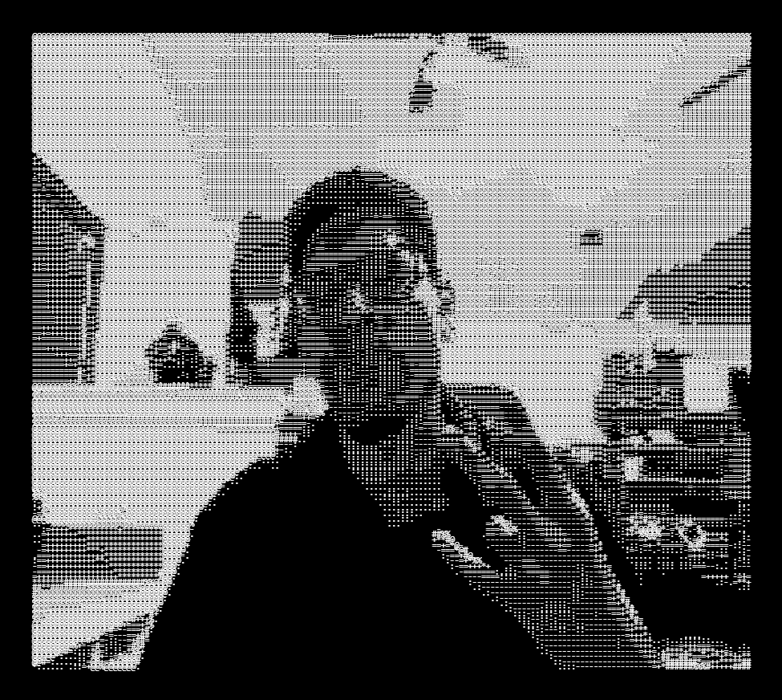

# Webcam ASCII Filter

A fun interactive web experience that converts your live webcam feed into real‑time ASCII art.\

------------------------------------------------------------------------

## 🌐 Live Demo

[Demo Website](https://google.com/)

------------------------------------------------------------------------

## 📸 Screenshot



------------------------------------------------------------------------

## 🚀 Features

- ✅ Live webcam access & permission prompt  
- ✅ Real-time conversion of video frames to ASCII art (monochrome or shade-based)  
- ✅ Adjustable ASCII character set, density / scaling (configurable by user)  
- ✅ Runs entirely client-side — no server, no dependencies  
- ✅ Simple fallback if webcam access is denied (optional) 

------------------------------------------------------------------------

## 🧪 Tech Stack

-   **HTML5 Video API**\
-   **JavaScript Canvas API**\
-   **ASCII rendering logic**\
-   **CSS minimal UI**

------------------------------------------------------------------------

## 🛠️ How It Works

1.  The webcam stream is captured using
    `navigator.mediaDevices.getUserMedia()`.\
2.  Each frame is drawn onto a hidden `<canvas>`.\
3.  Pixel brightness is mapped to ASCII characters.\
4.  The ASCII output is written to a `<pre>` block for live display.

------------------------------------------------------------------------

## 📦 Installation & Usage

Clone the repository:

``` bash
git clone https://github.com/yourname/webcam-ascii-filter
cd webcam-ascii-filter
```

Run using any local server:

``` bash
npm run
```

------------------------------------------------------------------------

## 📄 License

MIT License.
